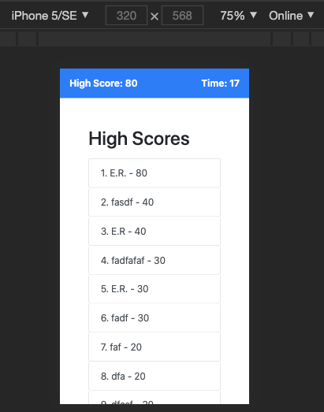

# Edward Reyes: Code Quiz
Due date: 08/02/2020


## The game

As part of my assignment, I've created a Quiz Trivia game that asks players 20 random questions of various subjects. The user is asked either multiple choice questions or true or false questions. The user also only has 120 seconds to complete the quiz. The game will end when either all questions have been answered or when the time as run out. Also, there is a 10 second minus penalty for each wrong answer.


### Starting page

The current highsest score is displayed the top left, to motivate user's to try and top that score. But more importantly, the game retrieves the highest score by sorting the array of user scores in descending order using a merger sort. Then it retrieves the first element which will be the highest score saved.

This code is not mine, I've referenced an existing merge sort algorithm and modified it to work with my questions array object.

Reference: // reference: https://medium.com/javascript-in-plain-english/javascript-merge-sort-3205891ac060
```
// Merge sort:

function mergeSort(arr) {
    // if array only has 1 element, no need to sort
    if (arr.length <= 1) {
        return arr;
    }

    // find the middle
    const middle = Math.floor(arr.length / 2);

    // divide array into left and right
    const left = arr.slice(0, middle);
    const right = arr.slice(middle);

    // use recursion to combine left and right
    return merge(mergeSort(left), mergeSort(right));
}

// Merge two arrays: left and right
// reference: https://medium.com/javascript-in-plain-english/javascript-merge-sort-3205891ac060
function merge(left, right) {
    let resultArray = [], leftIndex = 0, rightIndex = 0;

    // Concatenate values into the resultArray in order
    while (leftIndex < left.length && rightIndex < right.length) {
        if (left[leftIndex].score > right[rightIndex].score) {
            resultArray.push(left[leftIndex]);
            leftIndex++; // move left array cursor
        } else {
            resultArray.push(right[rightIndex]);
            rightIndex++; // move right array cursor
        }
    }

    // Concat arrays
    return resultArray
        .concat(left.slice(leftIndex))
        .concat(right.slice(rightIndex));
}

```


## LINK TO DEPLOYED APPLICATION

[GitHub Pages](https://edwardreyes29.github.io/CodeQuiz/)


The game is ready to play when the use clicks the "Start Quiz" button.


### When the game starts


The game saves it's questions as object in the script.js file. and dynamically renders them on the page by targeting certain divs to display the contents of the questions. I thought it would be easier to do this rather than creating separate elements on the HTML DOM separately, that way, I can always add new questions without ever having to edit the html file.

The questions are picked at random. So each playthrough will display the same 20 questions at different orders. 


### When game is finished

### input validation

Using Bootstraps is-valid and is-invalid classes, the code will reveal red borders and a message when user's attempt to enter an empty string.


### Scoreboard

Here the user has the option to enter their initials. The highest score will not be updated until the user decides to enter their initials, therefore saving their score and displaying it if it is greater than the highest score. This page also displays the user's current score.


Players can choose to retake the quiz, which will send them back to the start of the game (basicially reloading the page to start the game over) and they also have the option to clear the scoreboard, which will remove the scores from the game as well as any saved scores and initials in the localStorage.


### Responsive pages

The page is also responsive, thanks to the capabilities of bootstrap.




### CSS
I used minimal css, mostly just to set view height and have certain display hidden by default.

